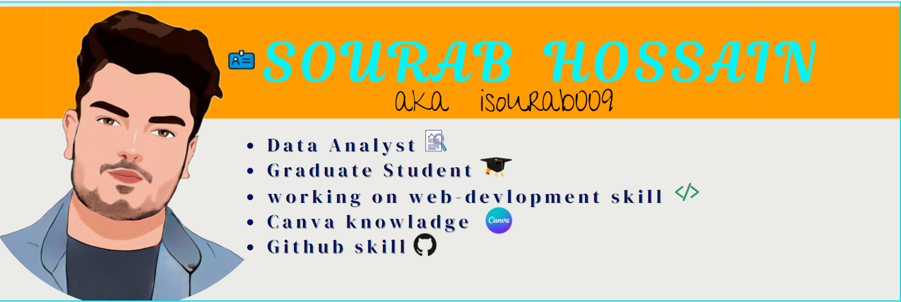

<h2>Hey! 👋</h2>

I'm SOURAB HOSSAIN ! I'm a Data Analyst . I'm from INDIA (west-bengal).
- <i>Currently:</i> Graduating in ECONOMICS from ALIAH UNIVERSTY  

<h2>💻 I'm Currently working on</h2>

- Web Devlopment course.
- Exploring diffrent fields & upgrading skills on that.

<h2> About isourab009⚡:</h2>

I'm a Graduate Student living in Kolkata (INDIA), ALIAH UNIVERSITY . I'm a DATA ANLYST. I love to read , Sudeep Nagarkar  & Chetan Bhagat are in list of my favorite authors . i love to enjoy music and explore nature outdoors. If you are around KOLKATA , drop an email and let's catch-up over Coffee!

<h2> My Linkedin :</h2>
  
<a class="badge-base__link LI-simple-link" href="https://in.linkedin.com/in/sourab009?trk=profile-badge">MD ABDUL SOURAB HOSSAIN</a>

              
 

- Write to me: [ConnectWith@isourab.com](prince009.hossain@gmail.com)

<h2>📫 How to reach me:</h2>

 

